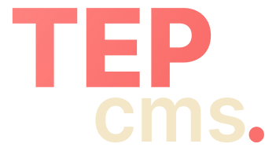

<p align="center">
  
</p>


## 📚 Table of Contents

- [Features](#features)
- [Installation](#installation)
- [File Structure](#file-structure)
- [More Information](#content-templates)
- [Developer tips](#tips)
- [Suggestions or Issues](#contribute)


<h2 id="features">📦 Features</h2>

- ⚡ **File-based Content** – no DB needed.
- 🧱 **Reusable Blocks** – with a modular `page_builder`.
- 📁 **Organized Assets** – with a modern media library.
- 🎨 **SCSS Styling** – modular, maintainable styles.
- 🧪 **Easy Local Dev** – run with nearly zero setup.
- 🚀 **Lightweight & Fast** – powered by Express & EJS.
- 👥 **Multiple users** – Allows the user to have multiple accounts.
- 🕙 **Content scheduler** - Plan when a post should be released
- 🔖 **Content versioning** - Configurable content versioning of entries
- 🧩 **Headless mode** - Use headless mode to implement TEP anywhere

<h2 id="installation">🛠 Installation</h2>

1. Clone the repo and install dependencies:
   ```bash
   npm install
    ```
2. Copy the example config and customize it:
    ```bash
    cp config.example.ts config.ts
    ```
3. Run the development server
    ```bash
    npm run dev
    ```
4. Build for production
    ```bash
    npm run prod
    ```


<h2 id="file-structure">File Structure</h2>

```bash
tep-cms/
├── content/
│   ├── collections/      # All collections (pages, blogs etc.)
│   ├── globals/          # Global site settings (header, footer settings etc.)
│   ├── navigation/       # Navigation menu's
│   └── schemas/          # Collections & globals schemas
├── core/
│   ├── interfaces/       # Interface exports
│   ├── manager/
│   │   ├── controllers/  # Manager route controllers.
│   │   ├── helpers/      # Manager route helpers.
│   │   └── services/     # Manager controller services.
│   ├── middlewares/      # Global middleware
│   ├── services/         # Route services
│   └── validation/       # Validation system
├── public/
│   ├── assets/
│   │   ├── base/         # Static theme images, icons, etc.
│   │   └── uploads/      # Uploaded images, icons, etc.
│   └── css/              # Compiled SCSS styling
├── src/
│   ├── blocks/           # Page_builder blocks & components
│   ├── requests/         # Request validators
│   ├── routes/           # System routing
│   ├── templates/
│   │   ├── layouts/      # Page layouts
│   │   ├── manager/      # /manager views
│   │   └── views/        # Public views
│   ├── types/            # Package definitions
│   └── utils/            # Utility functions
├── styles/               # SCSS styling
├ config.ts
└ server.ts
```

<h2 id="tips">🧪 Development Tips</h2>

- Use version control to track content
- Turn off caching during the development fase
- [error codes](.github/docs/error-codes.md)

<h2 id="contribute">🙋 Suggestions or Issues</h2>

If you find bugs or have suggestions, feel free to open an [issue](https://github.com/JirzyKerklaan/tep-cms/issues/new).

