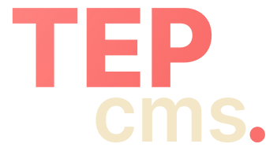

<p align="center">
  
</p>

# TEP CMS

**The Evergrowing, Powerful CMS:** a fast, file-based content management system that's perfect for modern static and dynamic websites.

<br>

## 📚 Table of Contents

- [Features](#features)
- [Installation](#installation)
- [File Structure](#file-structure)
- [More Information](#more-information)

<br>

<h2 id="features">✨ Features</h2>

- ⚡ **File-based Content Storage** (No DB required)
- 🖼 **Organized Asset Management**
- 🎨 **SCSS-based Styling**
- 🪄 **Live Preview Editing**
- 🖥️ **Easy Local Development**
- 🚀 **Fast and Lightweight**

<br>

<h2 id="installation">🛠 Installation</h2>

1. Clone the repo and install dependencies:
   ```bash
   npm install
    ```
2. Copy the example config and customize it:
    ```bash
    cp config.example.ts config.ts
    ```
3. Run the development server
    ```bash
    npm run dev
    ```
4. Build for production
    ```bash
    npm run prod
    ```
5. Now your site is ready for deployment!

<br>

<h2 id="file-structure">File Structure</h2>

```bash
tep-cms/
├── content/
│   ├── collections/      # All collections (pages, blogs etc.)
│   └── navigation/      # Navigation menu's
├── public/
│   ├── assets/
│   │   ├── base/        # Static theme images, icons, etc.
│   │   └── uploads/     # Uploaded images, icons, etc.
│   └── css/             # Compiled SCSS styling
├── styles/                # SCSS styling
├── src/
│   ├── blocks/          # Usable blocks
│   ├── helpers/         # System helpers
│   ├── manager/         # /manager system
│   ├── middlewares/     # Route middleware
│   ├── navigation/      # Navigation system
│   ├── routes/          # Public routes (to collections)
│   ├── templates/       # Templates for pages & collections
│   └── types/           # Session definitions
└ server.ts              # System entry-point
```

<h2 id="more-information">📘 More Information</h2>

### 🗃️ File-Based Content Management
All website content is stored in JSON format under the `content/` folder. No databases are required—this makes the CMS fast, lightweight, and easy to manage with version control.

### 🧾 Asset Management
- `assets/uploads/` – stores user-uploaded images and files.
- `assets/base/` – contains default theme assets and reusable base images.

### 🎨 SCSS Styling
The CMS uses SCSS for styling, making it easy to organize and maintain styles with variables, mixins, and modular architecture.

### 👀 Live Preview Editing
Edit content and instantly see a live preview of the website, improving the workflow and reducing guesswork during content updates.

### 🧪 Easy Local Development
Set up and run TEP CMS on your local machine for safe testing and development before deploying to production.

---

If you find bugs or have suggestions, feel free to open an [issue](https://github.com/JirzyKerklaan/tep-cms/issues/new).
